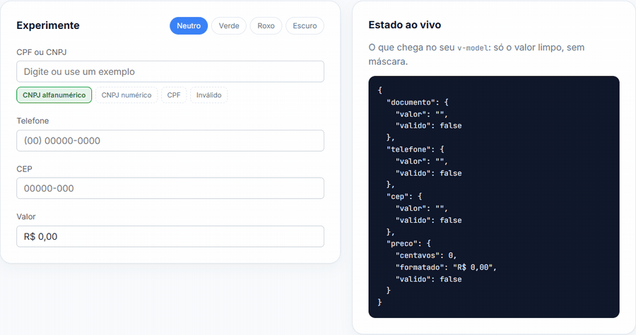

<div align="center">

# campos-br

**Campos de formulário brasileiros para Vue 3: CPF, CNPJ, CEP, telefone e moeda com máscara, validação e estado de erro prontos.**

[](https://www.npmjs.com/package/campos-br)
[](https://www.npmjs.com/package/campos-br)
[](https://bundlephobia.com/package/campos-br)
[](https://github.com/guubernardi/campos-br/actions/workflows/ci.yml)
[](./LICENSE)
[](#-pronto-para-o-cnpj-alfanumérico)

[**Demo ao vivo**](https://guubernardi.github.io/campos-br/) · [npm](https://www.npmjs.com/package/campos-br) · [Sem Vue](#-sem-vue-funções-puras) · [Contribuir](#contribuindo)



</div>

```bash
npm install campos-br
```

- ✅ Componentes prontos com máscara, validação e estado de erro
- ✅ **CNPJ alfanumérico** (em produção desde julho de 2026) já suportado
- ✅ Busca de endereço por CEP via [ViaCEP](https://viacep.com.br), com fonte injetável
- ✅ Composables para usar a lógica no seu próprio input
- ✅ Funções puras que funcionam **sem Vue** (React, Angular, Node...)
- ✅ Zero dependências de runtime, totalmente tipado e tematizável por CSS
- ✅ Funciona em Nuxt 3 sem configuração extra

## 🆕 Pronto para o CNPJ alfanumérico

Desde julho de 2026 a Receita Federal emite CNPJs com **letras** nas 12 primeiras posições (os 2 dígitos verificadores continuam numéricos). Validadores e máscaras que aceitam só números recusam esses documentos.

O `campos-br` valida e mascara os dois formatos e detecta o tipo sozinho, inclusive enquanto o usuário digita:

```ts
validarCnpj('12.ABC.345/01DE-35') // true
validarCnpj('11.222.333/0001-81') // true (formato antigo continua valendo)
mascararCnpj('12abc34501de35')   // '12.ABC.345/01DE-35'
```

## Por que campos-br?

| | Biblioteca de máscara genérica | **campos-br** |
|---|:---:|:---:|
| Máscara de CPF, CNPJ, CEP, telefone | ✅ (você configura o padrão) | ✅ pronta |
| Validação de dígito verificador | ❌ | ✅ |
| CNPJ alfanumérico | ❌ | ✅ |
| Estado de erro e `v-model:valido` | ❌ | ✅ |
| Busca de endereço por CEP | ❌ | ✅ |
| Moeda em centavos inteiros (sem erro de ponto flutuante) | ❌ | ✅ |
| Funções puras para usar no backend | ❌ | ✅ |

## Uso rápido

```vue
<script setup lang="ts">
import { ref } from 'vue'
import { CampoDocumento, CampoTelefone, CampoCep, CampoMoeda } from 'campos-br'
import 'campos-br/estilo.css' // opcional, mas recomendado

const cpf = ref('')
const telefone = ref('')
const cep = ref('')
const preco = ref(0) // em centavos
</script>

<template>
  <CampoDocumento v-model="cpf" rotulo="CPF / CNPJ" obrigatorio />
  <CampoTelefone v-model="telefone" rotulo="Telefone" />
  <CampoCep v-model="cep" rotulo="CEP" @endereco-encontrado="(e) => console.log(e)" />
  <CampoMoeda v-model="preco" rotulo="Preço" />
</template>
```

> O CSS **não** é injetado automaticamente. Importe `campos-br/estilo.css` (ou estilize as classes você mesmo).

Requer Vue `^3.3` como peer dependency.

## 🧩 Sem Vue: funções puras

Validadores, máscaras e busca de CEP também estão em `campos-br/validadores`, uma entrada que **não importa o Vue**. Use em React, Angular, Svelte, Node ou JavaScript puro:

```ts
import { validarCpf, validarCnpj, mascararTelefone, buscarCepViaCep } from 'campos-br/validadores'

validarCpf('529.982.247-25')        // true
mascararTelefone('11987654321')     // '(11) 98765-4321'
await buscarCepViaCep('01310-100')  // { logradouro: 'Avenida Paulista', ... }
```

Exemplo em React:

```tsx
import { useState } from 'react'
import { mascararCnpj, validarCnpj } from 'campos-br/validadores'

export function CampoCnpj() {
  const [valor, setValor] = useState('')
  return (
    <>
      <input value={mascararCnpj(valor)} onChange={(e) => setValor(e.target.value)} />
      {valor && !validarCnpj(valor) && <span>CNPJ inválido</span>}
    </>
  )
}
```

## Componentes

Todos os componentes compartilham as props base abaixo e expõem `v-model` (valor) e `v-model:valido` (booleano de validade).

| Prop          | Tipo      | Padrão          | Descrição                                |
| ------------- | --------- | --------------- | ---------------------------------------- |
| `rotulo`      | `string`  | -               | Texto do `<label>` (omitido se ausente). |
| `id`          | `string`  | -               | `id` do input (e `for` do label).        |
| `placeholder` | `string`  | -               | Placeholder do input.                    |
| `desabilitado`| `boolean` | `false`         | Desabilita o input.                      |
| `obrigatorio` | `boolean` | `false`         | Marca como obrigatório.                  |
| `mensagemErro`| `string`  | varia por campo | Mensagem exibida quando inválido.        |

O erro só aparece após o primeiro `blur` (campo "tocado").

### `CampoDocumento`

CPF ou CNPJ: detecta o formato automaticamente. Até 11 dígitos é CPF; acima disso, ou com qualquer letra, é CNPJ (inclusive alfanumérico). O `v-model` guarda o valor limpo (só dígitos, ou alfanumérico no CNPJ).

```vue
<CampoDocumento v-model="doc" v-model:valido="docValido" rotulo="Documento" />
```

### `CampoTelefone`

Telefone fixo `(00) 0000-0000` ou celular `(00) 00000-0000`. O `v-model` guarda apenas os dígitos.

```vue
<CampoTelefone v-model="tel" rotulo="Telefone" />
```

### `CampoCep`

Máscara `00000-000`. Ao completar um CEP válido, busca o endereço automaticamente e emite `endereco-encontrado`. O `v-model` guarda apenas os dígitos.

| Extra                       | Tipo                                  | Descrição                                   |
| --------------------------- | ------------------------------------- | ------------------------------------------- |
| prop `buscarEndereco`       | `(cep: string) => Promise<Endereco>`  | Fonte de busca customizada (padrão: ViaCEP).|
| evento `endereco-encontrado`| `(endereco: Endereco) => void`        | Disparado após busca bem-sucedida.          |

```vue
<CampoCep v-model="cep" rotulo="CEP" @endereco-encontrado="preencher" />
```

### `CampoMoeda`

Valor monetário em Real (`R$ 1.234,56`), digitação estilo calculadora (os dígitos preenchem da direita para a esquerda). O `v-model` guarda o valor em **centavos inteiros** (ex.: `R$ 1.234,56` → `123456`), evitando erros de ponto flutuante. É considerado válido quando maior que zero.

```vue
<CampoMoeda v-model="precoEmCentavos" rotulo="Preço" obrigatorio />
```

## Composables

Para usar a lógica com seu próprio markup. Recebem um `Ref` e retornam o valor mascarado, a validade e o handler de input.

```ts
import { ref } from 'vue'
import { useDocumento, useTelefone, useCep, useMoeda } from 'campos-br'

const cep = ref('')
const { mascarado, valido, aoDigitar, endereco, carregando, erro, buscar } = useCep(cep)
```

- `useDocumento(modelo: Ref<string>)` → `{ mascarado, tipo, valido, aoDigitar }`
- `useTelefone(modelo: Ref<string>)` → `{ mascarado, valido, aoDigitar }`
- `useMoeda(modelo: Ref<number>)` → `{ mascarado, valido, aoDigitar }`
- `useCep(modelo: Ref<string>, opcoes?)` → `{ mascarado, valido, aoDigitar, endereco, carregando, erro, buscar }`

## Funções utilitárias

Disponíveis em `campos-br` e em `campos-br/validadores`:

```ts
import {
  validarCpf, validarCnpj, validarCep,
  mascararCpf, mascararCnpj, mascararCep, mascararTelefone, mascararMoeda,
  centavosDeTexto,
  apenasDigitos, apenasAlfanumerico,
  buscarCepViaCep, type Endereco,
} from 'campos-br/validadores'

validarCpf('529.982.247-25') // true
mascararMoeda(123456)        // "R$ 1.234,56"
centavosDeTexto('R$ 12,34')  // 1234
```

## Tematização

Os componentes usam classes prefixadas com `campos-br-` e variáveis CSS com valores neutros por padrão. Sobrescreva o que quiser (veja os temas prontos na [demo](https://guubernardi.github.io/campos-br/)):

```css
:root {
  --campos-br-cor-texto: #1f2933;
  --campos-br-cor-rotulo: #52606d;
  --campos-br-cor-borda: #cbd2d9;
  --campos-br-cor-foco: #3b82f6;
  --campos-br-cor-erro: #d64545;
  --campos-br-cor-fundo: #ffffff;
  --campos-br-cor-fundo-desabilitado: #f5f7fa;
  --campos-br-raio: 6px;
  --campos-br-espacamento: 0.25rem;
  --campos-br-preenchimento: 0.5rem 0.75rem;
  --campos-br-fonte: inherit;
  --campos-br-tamanho-fonte: 1rem;
}
```

## Contribuindo

Este projeto é **open source** e contribuições são muito bem-vindas! 🎉

Procurando por onde começar? Veja as issues marcadas com [`good first issue`](https://github.com/guubernardi/campos-br/issues?q=is%3Aopen+label%3A%22good+first+issue%22): novos campos como chave Pix, placa Mercosul e CNH, ótimos para a primeira contribuição (e válidos no Hacktoberfest).

1. Faça um **fork** do repositório
2. Crie uma branch para a sua mudança (`git checkout -b minha-melhoria`)
3. Rode os testes (`npm test`) e garanta que tudo passa
4. Abra um **Pull Request** descrevendo o que mudou

Para rodar a demo localmente: `npx vite --config demo/vite.config.ts`.

Todo PR aceito entra na lib, e **quem contribui é adicionado aos créditos** abaixo. 💜

### Créditos

- [@guubernardi](https://github.com/guubernardi): criador e mantenedor

Se a lib te ajudou, deixe uma ⭐. Isso ajuda outros devs a encontrarem o projeto.

## Licença

[MIT](./LICENSE)
